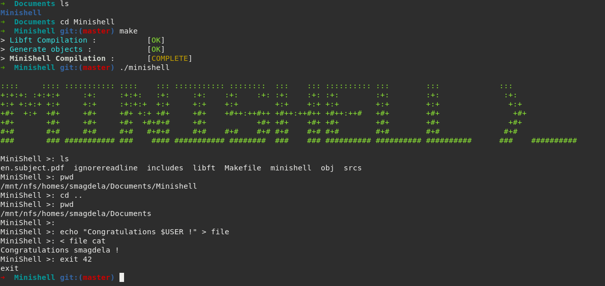

# 42-minishell Summary
42's project that aims at recreating a little shell from scratch, in C, reproducing the behavior of bash.

# Mandatory Instructions
We add to implement the following features:
 - Display a prompt when waiting for a new command.
 - Have a working history.
 - Search and launch the right executable (based on the PATH variable or using a relative or an absolute path).
 - Not use more than one global variable.
 - Not interpret unclosed quotes or special characters which are not required by the subject such as \ (backslash) or ; (semicolon).
 - Handle ’ (single quote) which should prevent the shell from interpreting the meta-characters in the quoted sequence.
 - Handle " (double quote) which should prevent the shell from interpreting the meta-characters in the quoted sequence except for $ (dollar sign).
 - Implement redirections: <, >, << and >>.
 - Implement pipes.
 - Handle environment variables which should expand to their values.
 - Handle $? which should expand to the exit status of the most recently executed foreground pipeline.
 - Handle signals ctrl-C, ctrl-D and ctrl-\ which should behave like in bash.
 - The following builtins:
 echo with option -n
 cd with only a relative or absolute path
 pwd with no options
 export with no options
 unset with no options
 env with no options or arguments
 exit with no options
 - Follow the 42's norm of code (a set of rules to standardize the way our code is written).
 - Use only the allowed functions.

# How to Use
Clone the repository in the location of your choice, go inside it, then compile using make command:
```
cd 42-minishell
make
```
Launch minishell! You can use the command make leak to launch it using valgrind to detect memory issues like leaks (except those coming from readline function, which could not be fixed).
```
./minishell
```
or
```
make leak
```
You can also use the -c option in order to bypass the prompt and get minishell's result directly:
```
./minishell -c '<your_command_here>'
```
Enjoy!

# Example


# Special Thanks
I'd like to thank every single one of my fellow coworkers who greatly supported me, starting with my teammate [chduong](https://github.com/chduong42):
 - [ajealcat](https://github.com/ajealcat)
 - [fahima8897](https://github.com/fahima8897)
 - [vietdu91](https://github.com/vietdu91)
 - [tmanolis](https://github.com/tmanolis)
 - [marineks](https://github.com/marineks)
 - [Batche-Hub](https://github.com/Batche-Hub)
 - [benjaminbrassart](https://github.com/benjaminbrassart)
 - [ethan0905](https://github.com/ethan0905)
 - [mderome](https://github.com/mderome)
 - [JonathanDUFOUR](https://github.com/JonathanDUFOUR)
